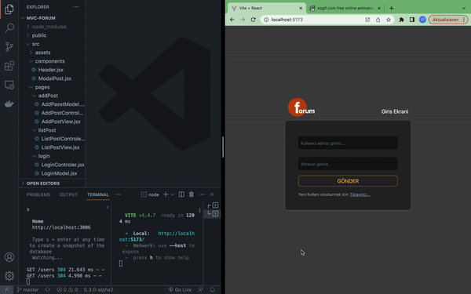

# Project Title

-MVC forum app-

## Acknowledgements

 - [Mehmet Can Seyhan (@isvec_krali)](https://twitter.com/isvec_kraIi)
 - [Furkan Evin](https://www.linkedin.com/in/furkan-evin/)

 

## Yapilacaklar Detay

1- Register formu olustur ve json olarak veri tabaanina göndder

2- Login formu olustur ve kullanicii bilgilarini API ye ve localStorige e gönder

3- Kullanici girisini sagla

4- Forum sayfasiina yeni mesaj 
göndermek icin yeni form olustur

5- Forum ana sayfada gönderikeri listele, kullaniiciya göre filtrele

## Authors

- [@Mehmet1414](https://www.linkedin.com/in/mehmet1414/)

## Demo

</img>

## API Reference

JSON Server api : port 3006

## 🚀 About Me
I'm a FrontEnd developer...

https://github.com/Mehmet1414
## Tech Stack

**Client:** React, Redux, TailwindCSS

**Server:** JSON-Server

